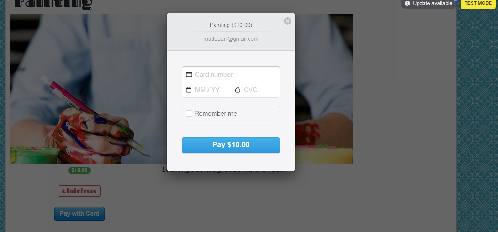

# Flixter - README

## Home page :
On the homepage click "Learn More" to advance to courses index,
* [Flixter] (https://flixter-matt-parr.herokuapp.com/)

In the top navigation menu (click box in upper left) a user can sign in, access user dashboard and lessons, (search bar inactive currently)
* [Home] (https://flixter-matt-parr.herokuapp.com/)

![Top nav menu.png] (./app/assets/images/Top nav menu.png)

In the courses index select course name or click on "more details" to view individual course lessons,
* [Courses] (https://flixter-matt-parr.herokuapp.com/courses)

On the course page user can enroll and pay for lessons using * [Stripe] (stripe.com) payment processing. Imported with Ruby 'stripe gem',
Paymeny processing is currently in 'test mode' so no real transactions can be done. (test card no. 4242 4242 4242 4242, exp date: any after today,
cvc: any 3 digits) Payment will enroll student into course.

Clicking on lessons brings the user to specific lesson page with video, (carrierwave)

User dashboard shows what courses user added and/or is enrolled in,

Footer hosts links to adding a course, accessing user dashboard, different about pages, contact info and social media links,

* System dependencies: Postgresql, stripe, aws

